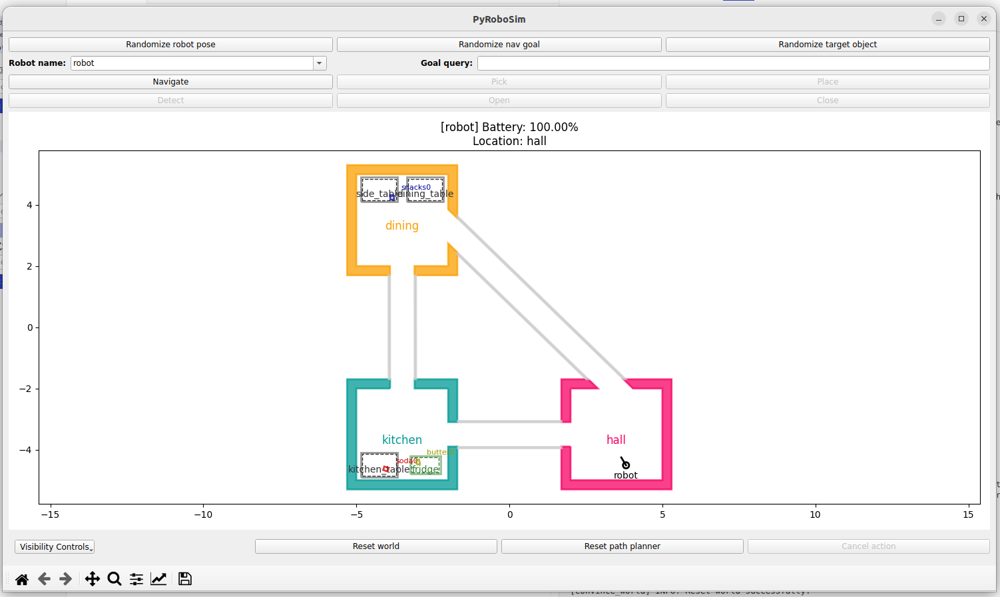

# Tutorial Introduction

## Running the simulation

These tutorials are designed to give you a introduction to the tools that the CONVINCE toolbox provides by walking you through using them on a simple example.
The example that all the tutorials are based on is a fetch and carry task, where a mobile robot moves in a household environment, picks up an object, and delivers it to a target location.

To run the simulation for the tutorials, execute in the root of the repository:

```bash
docker compose pull
docker compose up -d
docker compose run base ros2 run tutorial_sim run 
```

You should see a GUI something like this:


