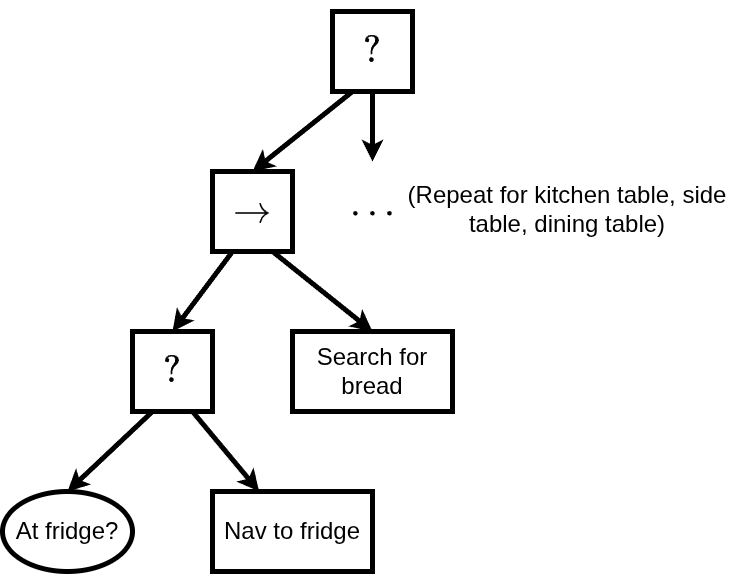
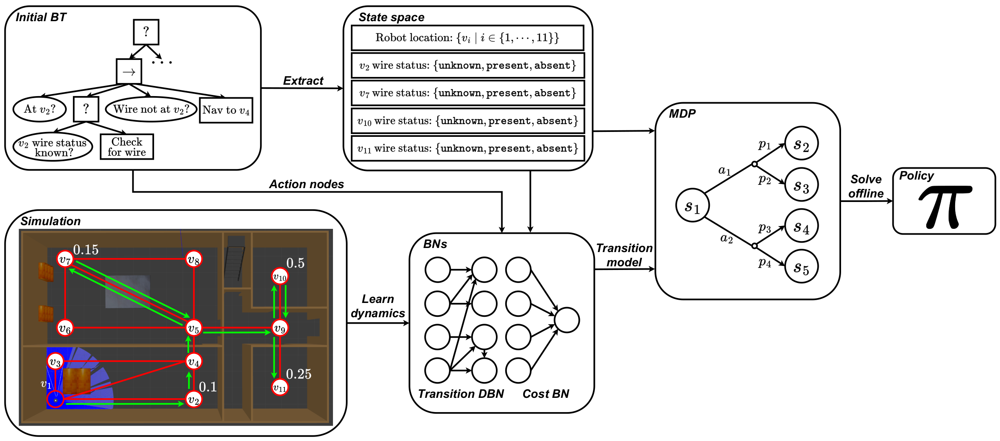

# REFINE-PLAN Demo

This demo shows the robot executing refined behaviours within the Pyrobosim simulation.

## Building and Running the Docker Container for this Tutorial

> [!WARNING]
> You must be in the `data-model/examples/overarching_tutorial/simulation` folder for this to work.

### Building the Docker container

```bash
docker build -t convince_tutorial -f .docker/Dockerfile .
```

### Running the Docker Container

```bash
docker run -it --rm\
    --name convince_tutorial\
    -v /tmp/.X11-unix:/tmp/.X11-unix:rw\
    -v ${XAUTHORITY:-$HOME/.Xauthority}:/root/.Xauthority\
    -v ./tutorial_sim:/convince_ws/src/tutorial_sim\
    -v ./refine_plan_demo:/convince_ws/src/refine_plan_demo\
    -v ./.docker/build:/convince_ws/build\
    -e DISPLAY\
    -e QT_X11_NO_MITSHM=1\
    convince_tutorial\
    bash 
```

## The Problem

The robot must search for a loaf of bread as quickly as possible within the following house environment:


The bread appears stochastically at:
* The **dining table** with probability **0.5**
* The **fridge** with probability **0.1**
* The **kitchen table** with probability **0.1**
* The **side table** with probability **0.3**

From this, it is clear that the bread is much more likely to appear in the dining room than the kitchen.

## The Initial BT
We begin with an initial BT for this problem which does not consider uncertainty.
In this instance, the BT does not know the bread's location distribution and so searches for it by moving 
**clockwise** around the environment until it finds it.
This is inefficient, as the robot searches the lower probability locations first.
A portion of the initial BT for the fridge can be seen below. The sequence node is repeated for the kitchen table, side table, and dining table.



### Running the Initial BT
After starting the Docker container, run:


```bash
cd src/refine_plan_demo/bringup
./run_demo.sh initial
```

From this, a tmux session will begin with two windows.
The first window is for the simulation, and the second is for execution.
The execution window provides insights into the robot's decision-making.
Upon running the demo the robot will begin searching for the bread by moving clockwise through the house.

## REFINE-PLAN
REFINE-PLAN is an automated tool for refining hand-designed BTs to improve robot performance under uncertainty.
We give an overview of the REFINE-PLAN framework in the image below:



REFINE-PLAN begins with an initial hand-designed BT and a simulator as input. 
From the initial BT we extract a state space for planning using the condition nodes and blackboard.
Next, we learn two Bayesian networks per action node in simulation which capture the stochastic transition and cost dynamics of robot execution.
We then construct a Markov decision process using the learned Bayesian networks and extracted state space, and solve it using standard techniques to synthesise a policy.
This policy can then be converted back to a BT.

### State Space Extraction
For this problem, we extract the following state factors:
* The robot's location in the house (hall, fridge, kitchen table, side table, dining table)
* A state factor for each location declaring whether the bread is present, or whether this information is unknown.

### Data Collection for Model Learning
To learn the stochastic transition and cost dynamics of the environment we require a **data collection** phase in simulation.
Here the robot executes actions randomly in the simulator. The recorded transitions are then used to learn the Bayesian networks.

To run data collection, you can run the following after starting the Docker container, where `<MONGO_CONNECTION_STRING>` is a connection string to a Mongo database, e.g. `localhost:27017`:

```bash
cd src/refine_plan_demo/bringup
./run_data_collection.sh <MONGO_CONNECTION_STRING>
```

### Synthesising the Refined Behaviour
Given the recorded transitions from the data collection phase, we can then:
* Learn the Bayesian networks for each BT action node
* Construct the MDP
* Solve it using standard techniques

These three steps can be executed for this problem by running the following [script](https://github.com/convince-project/refine-plan/blob/main/bin/overarching_demo_planning.py).
After running REFINE-PLAN, the robot learns the location distribution for the bread and prioritises searching higher probability locations first.
Visually, the robot now moves **anticlockwise** through the house, finding the bread quicker on average.

### Running the Refined Behaviour
After starting the Docker container, run:

```bash
cd src/refine_plan_demo/bringup
./run_demo.sh refined
```

From this, a tmux session will begin with two windows.
The first window is for the simulation, and the second is for execution.
The execution window provides insights into the robot's decision-making.
Upon running the demo the robot will begin searching for the bread by moving **anticlockwise** through the house.

## Further Information
For more information on REFINE-PLAN, you can:
* Visit our official [documentation](https://convince-project.github.io/refine-plan/)
* Look at the [source code](https://github.com/convince-project/refine-plan)
* Read the [paper](https://ieeexplore.ieee.org/document/11246986) 
