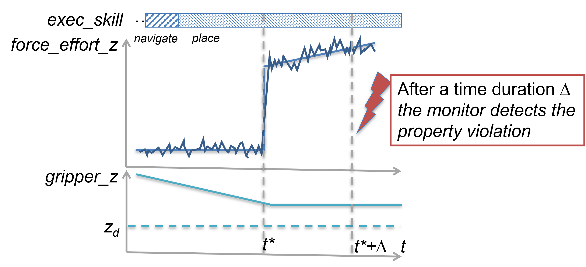
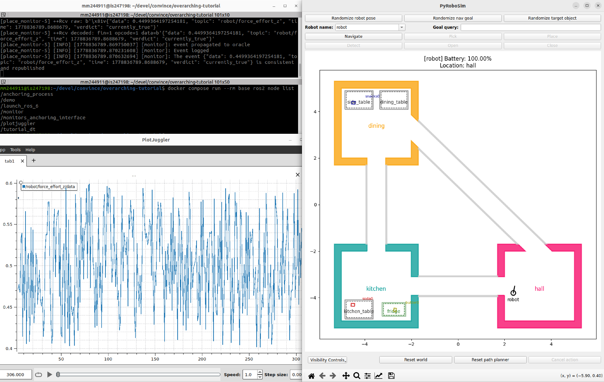
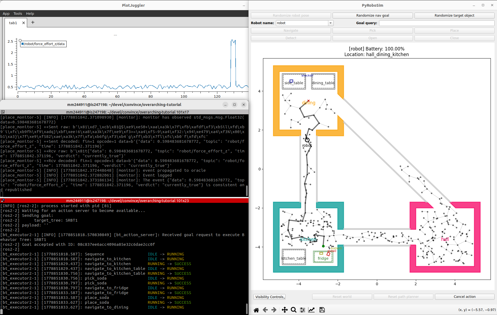
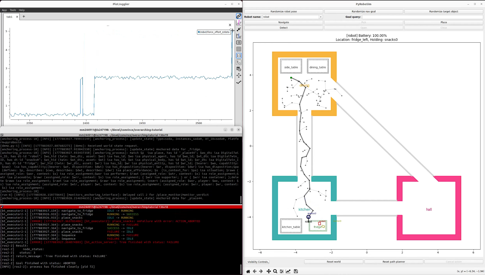
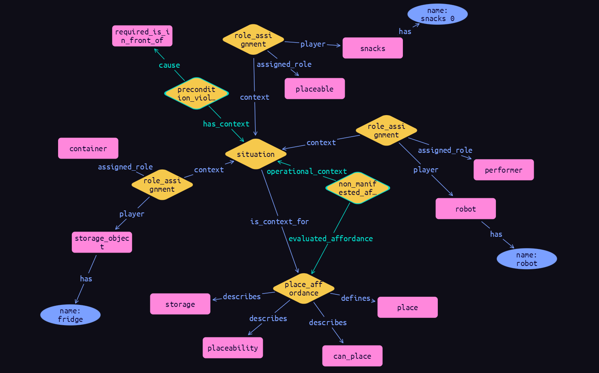
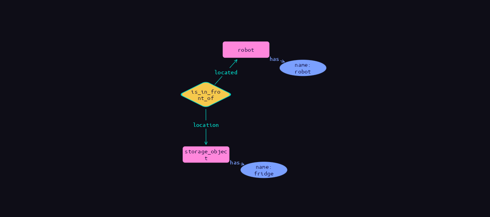

# Semantic Reasoning Tutorial

This tutorial demonstrates how the semantic reasoning module developed in CONVINCE can identify undesired situations at runtime.

All commands use `docker compose` and must be executed from the root of the repository, where `docker-compose.yml` is located.

A video of this tutorial is available on [YouTube](https://youtu.be/xWV7h7M_TRw?si=WKXO4SxqWZpkBg-c).

## The Problem

The robot is tasked with navigating a domestic environment to fetch soda and snacks, delivering them to the fridge one at a time.


During the execution of a place action, the force measured at the robot's end effector unexpectedly rises, while the gripper's z-position does not decrease to reach the desired place target.

This unexpected situation represents an undesired deviation from nominal operational conditions. It can be formally described as a property in temporal logics, allowing monitoring frameworks like [MOON](https://convince-project.github.io/overview/tutorial_moon.html) to detect when it is violated.



Though, detection alone is insufficient to determine the appropriate intervention. Rising force at the end-effector's tip can be due to multiple causes, such as collisions with objects making the place target inaccessible or adversarial human behavior obstructing the robot arm from reaching the target place.

Identifying the semantic nature of the anomaly is then crucial to apply informed intervention.

## Getting Started

Run this command to bring up all the system's components:

```bash
docker compose run --rm base ros2 launch semantic_reasoning_bringup bringup.launch.py
```

System's components include:

* `/demo`. An instance of PyRoboSim providing the virtual domestic environment for the robot to navigate.
* `/plotjuggler`. An instance of PlotJuggler that displays the values of a simple virtual force sensor at the tip of the robot's end-effector.
* `/tutorial_skill_executor`. A simple skill execution layer for the mobile robot. Skills are implemented by action servers that use the same interfaces as the [offline verified models](https://convince-project.github.io/overview/tutorial_roaml.html). The actual skill implementation is delegated to PyRoboSim. The component also provides a publisher for the name of the last executed skill and a service server for artificially injecting bugs in the robot's navigation system to force the occurrence of anomalies.
* `/monitor`. An instance of a [MOON](https://convince-project.github.io/overview/tutorial_moon.html) monitor for the place action, configured (see `misc/moon` directory) to verify this property at runtime: when executing `PLACE`, the effort shall not exceed 4.5N for more than 200ms.

    ```
    PROPERTY = "( {PLACE} -> ( once[0:0.2]( {effort <= 4.5} ) ) )"
    ```

* Components related to semantic reasoning (see below).



### Semantic Reasoning Components

Semantic reasoning components include:

* `/anchoring_process`. The component that integrates perception data with information in digital twins to produce a symbolic representation of operational environment. The inference mechanism at its core is enabled by a knowledge base constituted by an ontology, SKRAWL, and its rules. `/anchoring_process` is configured with a scene description in JSON format that maps entities in the digital twins to concepts in the SKRAWL ontology (see `misc/anchoring/dt/setup.json`). Information on functional entities comes from `/tutorial_skill_executor`, while that on geometric entities comes from `/tutorial_dt`.
* `/tutorial_dt`. The digital twin that provides geometric information of scene objects to `/anchoring_process`. This includes objects' bounding boxes and and runtime-changing data such as positions and orientations. `/tutorial_dt` uses PyRoboSim's `/request_world_state` service to access geometric information in the virtual scene and then packs it in JSON format for `/anchoring_process` to consume.
* `/monitors_anchoring_interface`. A component that listens to MOON monitors' verdict topics (`/place_monitor/monitor_verdict` in this example) and triggers the execution of the anchoring's knowledge update process when the violation of a monitored property is detected.
* An instance of [TypeDB Studio](https://typedb.com/docs/manual/2.x/studio/), to visually inspect the robot's internal knowledge (SKRAWL). To set up TypeDB Studio, (i) connect to the running TypeDB server (click `Connect to TypeDB` on the top right, then `Connect`); (ii) select the available database (`convince-semantic_reasoning_demo`) from the drop-down menu on the top left; and (iii) click on `Open Project`, then `Open` to access to ready-to-use queries for knowledge inspection.

## Nominal Execution

At the beginning, the robot operates without encountering any deviations from the planned mission. It successfully retrieves the soda and transports it to the fridge. Then it navigates seamlessly to the dining's side table and picks up the snacks.

To execute this initial phase of the mission, where everything proceeds as expected, run:

```bash
docker compose run --rm base ros2 launch semantic_reasoning_bringup policy_executor.launch.py target_tree:=SRBT1
```

The robot starts moving and logs of the BT status are printed in the console.



The behavior tree of this first part of the mission is `simulation_extras/bt_executor2/behavior_trees/bt_tree_1.xml`. Note, we assume full observability of objects, i.e., the robot does not need to use any object detector to find soda and snacks and add them to the world model.

## Anomaly Injection

At this stage, our demo scenario anticipates that the robot drifts during the execution of the next navigation action, causing it to end up at the corner of the fridge rather than in front of it. We simulate this drift by introducing a spurious navigation bug before the navigation action is executed using the following command:

```bash
docker compose run --rm base ros2 service call /robot/inject/spurious_navigation_bug std_srvs/srv/SetBool "{data: true}"
```

Additionally, we assume that the condition check programmed by the developers, which is intended to ensure that the robot has actually reached the target point, is incorrectly implemented. Consequently, the misplacement goes undetected. As a result, when the robot attempts to place the snacks in the fridge, it collides with the fridge's borders, causing the place action to fail.

This failing second part of the robot's mission can be run with:

```bash
docker compose run --rm base ros2 launch semantic_reasoning_bringup policy_executor.launch.py target_tree:=SRBT2
```



Note how, due to the collision with the fridge's borders, the effort at the robot's end-effector tip rises above the property threshold. MOON's place monitor detects the property violation, and the anchoring's knowledge update process is activated (visible in the console).

## Robot Knowledge Inspection

The execution of the anchoring's knowledge update process causes a series of interactions between `/anchoring_process` and the digital twins that are transparent to the user. The properties of ontology individuals are updated and inference rules are applied. The figure below illustrates how the application of inference rules (reasoning) deduces the cause of the non-manifestation of the place affordance for the robot’s place task. All the inferred knowledge is outlined in green.



`situation` is the central concept that represents the task execution. It serves as the context for a `place_affordance`, which defines a `place` task involving three participants: the `performer` of the action – the `robot`, which possesses the `can_place` capability; the `placeable` entity – the `snacks` held by the `robot`, which has the `placeability` disposition; and the `container` – the `fridge`, which has the `storage` disposition (the target where the `snacks` is to be placed).

The `situation` acts as the `operational_context` for the non-manifested place affordance. The `cause` of the non-manifestation is the absence of the `is_in_front_of` relation between the `performer` and the `container` (`required_is_in_front_of`), indicating that the `robot` is not in front of the `fridge`.

The snapshot of the robot's internal knowledge in the above figure is obtained with the following query in TypeDB Studio:

```bash
    match
      $nmpa (evaluated_affordance: $pa, operational_context: $sit) isa non_manifested_affordance;
      $pa (describes: $cwo, describes: $dwt, describes: $dwr) isa place_affordance;
      (has_context: $sit, cause: $cause) isa precondition_violation;
      (assigned_role: $ar, player: $p, context: $s) isa role_assignment;
      $p isa physical_entity, has name $pn;
    get;
```

## Mitigation Action

We assume that the previously described undesired system state corresponds to a known anomaly for which a predefined mitigation action exists. The mitigation strategy involves commanding the robot to move away from the fridge, perform a brief navigational loop in the kitchen, and then return to attempt correct positioning.

To simulate the successful application of this mitigation strategy, we first remove the injected spurious navigation bug before the robot executes the action to navigate away from the fridge. This is achieved using the following command:

```bash
docker compose run --rm base ros2 service call /robot/inject/spurious_navigation_bug std_srvs/srv/SetBool "{data: false}"
```

The successful final phase of the robot’s mission can then be executed with:

```bash
docker compose run --rm base ros2 launch semantic_reasoning_bringup policy_executor.launch.py target_tree:=SRBT3
```

In this case, MOON does not activate the anchoring's knowledge update process because the monitored property is not violated. But we can be manually trigger it using the following command:

```bash
docker compose run --rm base ros2 action send_goal /anchoring_process/update_state anchoring_process_interfaces/action/UpdateState "{knowledge_domain: 'SkrawlMoMa'}"
```

After executing the above query, the result will be empty, indicating that there are no longer any non-manifested place affordances in the system:

```bash
## Result> Get query did not match any concepts in the database.
```

Conversely, and as expected, querying the system now confirms that the `robot` is correctly positioned in front of the `fridge`:

```bash
match
  $f (located: $a, location: $p) isa is_in_front_of;
  $a isa artificial_agent, has name $an;
  $p isa physical_entity, has name $pn;
get;
```



## Further Information

For more information, you can:

* Visit our official [documentation](https://convince-project.github.io/sit-aw-anchoring/)
* Look at the [source code](https://github.com/convince-project/sit-aw-anchoring)
* Look at the [ontology](https://github.com/convince-project/sit-aw-skrawl)
